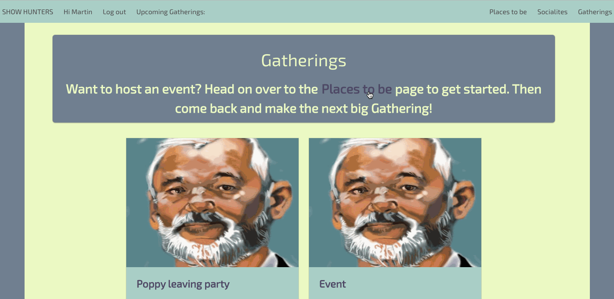

## WDI-Project-Two

#### Socialiser by Martin Allgood

Project two is an event hosting website built using Node.js & Express to host a Mongoose database and then EJS to render the front end pages. Over the course of one week we were asked to build a fully RESTful app, on a subject of our choice.

[Socialiser Webpage](http://socialiser.herokuapps.com)

--

Users first create the venue that they wish to be hosting their event on. If they have not got any venues then the site will prompt them to create one before hosting an event.

Once you have created a venue you can then host an event at it that other guests can look at and click attending and leave a comment if they wish.

--

**What was a win?**
I spent a lot of time building the models in order to be able to gather as much information as I could to display on the pages. This took up a fair amount of mine time meaning that I wasn't able to implement as much as I would have wanted but I was still able to display a large amount of what was available.

**What was difficult?**
I learnt a hard lesson during this project about when it is right to write dynamic code and when you should hard code something. I lost a lot of time at the start of the project implementing some unesscessary functions to populate the new user/venue/event forms. These took up a lot of time and also never got working 100%, leaving traces of the models that I was trying to loop over and take names from.

**What would you do differently?**
